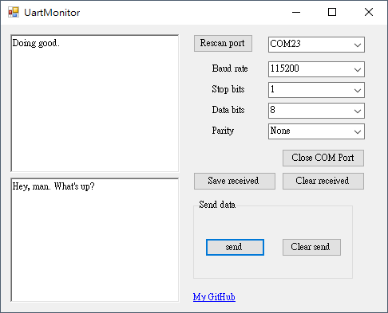

# uart_demo_CSharp

簡單示範如何使用 C# 進行 UART（串口）通信。

## ​ 專案簡介
本程式作為 C# 使用 `System.IO.Ports.SerialPort` 類別建立串口通信的基礎範例，適合用於與 MCU、Arduino 等硬體進行收發資料測試。

## 需求環境
- .NET 版本（請依實際專案決定，例如 .NET 6, .NET Framework 4.7.2 等）
- 作業系統：Windows（若支援跨平台請補充）
- 若使用 USB-to-Serial 轉接器，請確認已正確安裝對應驅動程式

## Demo
